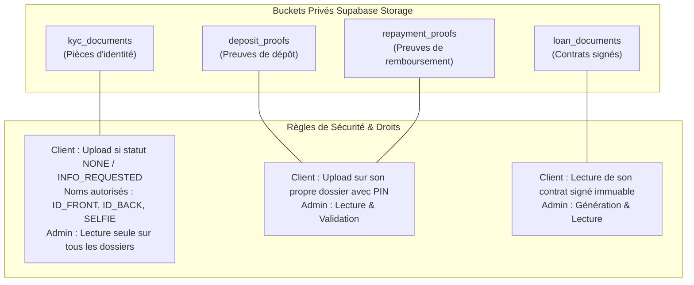

# Référence Technique & API — Microfinance v2.1

Ce document regroupe les spécifications des fonctions RPC `SECURITY DEFINER`, des tables PostgreSQL, des Edge Functions Deno et des politiques d'accès aux Buckets Supabase Storage.

---

## 1. Schéma de Base de Données

### 1.1 Tables de l'Espace Public (`public`)

| Table                 | Rôle / Description                                 | Clé Primaire           | Politiques RLS principales                                      |
| :-------------------- | :------------------------------------------------- | :--------------------- | :-------------------------------------------------------------- |
| `profiles`            | Profils utilisateurs, identité, KYC et métadonnées | `id` (FK `auth.users`) | Client : SELECT/UPDATE propre ligne ; Admin : SELECT tous       |
| `wallets`             | Portefeuilles comptables (5 composantes)           | `id`                   | Écritures directes interdites ; SELECT propre portefeuille      |
| `loan_products`       | Catalogues de produits de crédit versionnés        | `id`                   | SELECT tous (produits actifs) ; Admin : INSERT/UPDATE           |
| `loan_requests`       | Demandes de prêts et suivi des 10 états            | `id`                   | Client : SELECT/INSERT propre prêt ; Admin : SELECT/UPDATE      |
| `loan_schedules`      | Échéanciers d'amortissement prévisionnels          | `id`                   | Client : SELECT propre échéancier ; Admin : SELECT/UPDATE       |
| `loan_contracts`      | Contrats dynamiques signés et snapshots            | `id`                   | Client : SELECT propres contrats ; Admin : SELECT tous          |
| `deposit_requests`    | Demandes de dépôt d'épargne/garantie               | `id`                   | Client : SELECT/INSERT propres demandes ; Admin : SELECT/UPDATE |
| `withdrawal_requests` | Demandes de retrait Mobile Money                   | `id`                   | Client : SELECT/INSERT propres demandes ; Admin : SELECT/UPDATE |
| `repayment_requests`  | Demandes de remboursement de crédit                | `id`                   | Client : SELECT/INSERT propres demandes ; Admin : SELECT/UPDATE |

### 1.2 Schéma Privé (`app_private`)

| Table               | Usage / Isolation                                        | Accès                                                           |
| :------------------ | :------------------------------------------------------- | :-------------------------------------------------------------- |
| `user_pin_security` | Stocke `pin_hash` (BCrypt), `fail_count`, `locked_until` | Révqué pour `anon`/`authenticated`. `service_role` uniquement.  |
| `pin_recovery_otps` | Stocke les OTP HMAC-SHA256 et clés temporaires           | Révolé pour Data API. Traité uniquement par Edge Functions.     |
| `outbox_emails`     | File d'attente d'envoi d'emails (chiffrés AES-256-GCM)   | Mis à jour via Triggers, dépilé par Edge Function `send-email`. |

---

## 2. Fonctions RPC (`SECURITY DEFINER`)

### 2.1 RPC Portefeuille & Mouvements Financiers

#### `get_wallet_summary(p_user_id UUID)`

- **Description** : Retourne la synthèse des 5 composantes financières d'un utilisateur.
- **Sécurité** : `SECURITY DEFINER`, `search_path = ''`. Accessible aux rôles `authenticated`.
- **Retour** :
  ```json
  {
    "free_savings": 150000,
    "disbursed_loan": 500000,
    "blocked_guarantee": 50000,
    "mandatory_savings": 10000,
    "reserved_amount": 0
  }
  ```

#### `create_withdrawal(p_amount NUMERIC, p_operator TEXT, p_phone TEXT, p_holder TEXT)`

- **Description** : Réserve immédiatement le montant dans `reserved_amount` si le solde disponible est suffisant ($\text{free\_savings} + \text{disbursed\_loan} - \text{reserved\_amount} \ge \text{amount}$) et insère la demande avec le statut `PENDING`.
- **Sécurité** : Atomique et totalement protégée contre les conditions de course.

#### `confirm_deposit(p_request_id UUID, p_agent_id UUID)`

- **Description** : Valide un dépôt en attente. Crédite atomiquement le portefeuille selon le motif (`FREE_SAVINGS` ou `GUARANTEE`) et met à jour le statut du dépôt à `CONFIRMED`.

#### `reject_deposit(p_request_id UUID, p_agent_id UUID, p_reason TEXT)`

- **Description** : Passe la demande de dépôt à `REJECTED` et enregistre le motif dans l'historique sans impact comptable.

---

### 2.2 RPC Crédits, Garanties & Contrats

#### `process_guarantee_blocking(p_user_id UUID)`

- **Description** : Bloque le montant de garantie requis depuis `free_savings` vers `blocked_guarantee`. Si l'épargne est suffisante, le prêt passe de `ACCEPTED` à `GUARANTEE_COMPLETE`. Sinon, bloque le solde partiel et passe le prêt en `GUARANTEE_PENDING`.

#### `sign_loan_contract(p_loan_id UUID, p_pin TEXT)`

- **Description** : Vérifie le PIN de l'utilisateur via l'Edge Function, génère le document d'engagement immuable dans `loan_contracts` et fait passer le prêt à l'état `CONTRACT_SIGNED`.

#### `enforce_effective_cost_cap()` (Trigger)

- **Description** : Déclenché avant toute insertion/modification de produit ou demande de prêt. Calcule le Taux Effectif Global (TEG/IRR annualisé) et annule la transaction si $\text{TEG} > 20\%$.

---

### 2.3 RPC Onboarding & KYC

#### `submit_kyc_data(p_payload JSONB)`

- **Description** : Soumet les données d'identité et de revenus du client. Valide le pays UMOA, le format de téléphone, et passe le statut KYC à `PENDING`.
- **Sécurité** : Liste blanche de champs stricte (impossible d'injecter des privilèges).

#### `finalize_kyc_document(p_document_type TEXT, p_object_path TEXT, p_file_size INT, p_mime_type TEXT)`

- **Description** : Valide la présence effective du fichier dans le Storage Supabase avant d'associer la référence documentaire au dossier KYC.

---

## 3. Edge Functions Deno

Les Edge Functions sont déployées sur Supabase Cloud (`eu-west-3 Paris`) et s'exécutent dans un environnement Deno sécurisé.

### 3.1 `set-pin`

- **Méthode** : `POST /functions/v1/set-pin`
- **Headers** : `Authorization: Bearer <user_jwt>`
- **Payload** : `{ "pin": "1234" }`
- **Comportement** : Valide le format (4-6 chiffres), génère le hash `await bcrypt.hash(pin, 12)` et enregistre le résultat directement dans `app_private.user_pin_security`.

### 3.2 `verify-pin`

- **Méthode** : `POST /functions/v1/verify-pin`
- **Headers** : `Authorization: Bearer <user_jwt>`
- **Payload** : `{ "pin": "1234" }`
- **Comportement** : Contrôle les tentatives. Si échec, incrémente le compteur et applique un verrouillage temporaire progressif ($5\text{s}, 15\text{s}, 1\text{min}, 15\text{min}$).

### 3.3 `recover-pin`

- **Méthode** : `POST /functions/v1/recover-pin`
- **Comportement** : Reçoit une demande de réinitialisation, génère un OTP à 6 chiffres, calcule le HMAC-SHA256 avec `PIN_RECOVERY_SECRET`, chiffre l'OTP en AES-256-GCM et le dépose dans la file `outbox_emails`.

### 3.4 `send-email`

- **Méthode** : Trigger automatique / Cron / Invocation `service_role`.
- **Comportement** : Dépile les messages de `outbox_emails`, déchiffre les contenus en mémoire et envoie les emails via l'API HTTP Resend.

---

## 4. Politique des Buckets Storage

L'accès aux fichiers déposés est strictement restreint par des politiques RLS Storage Supabase.


