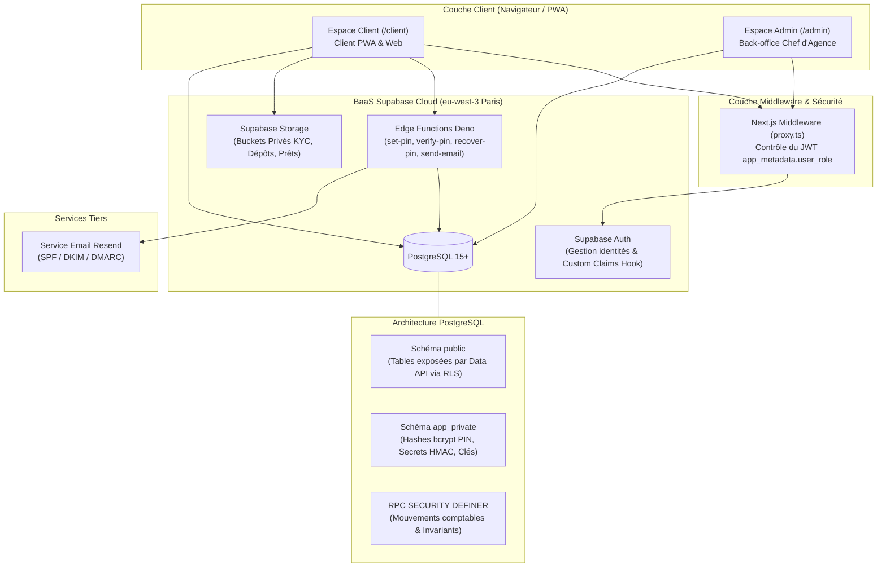
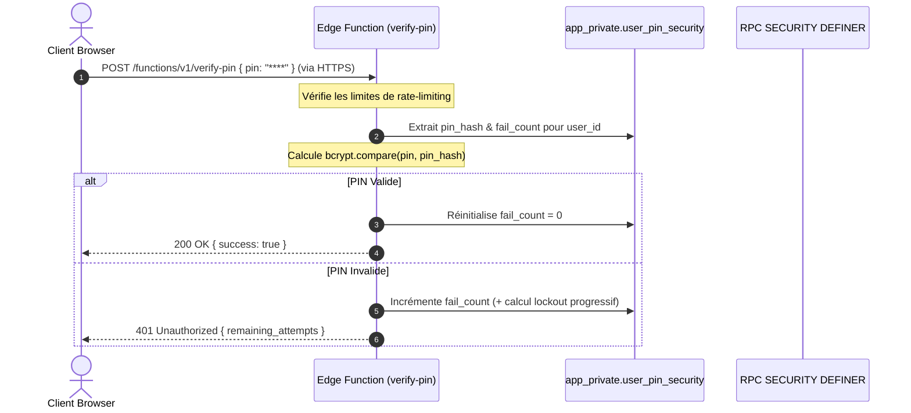
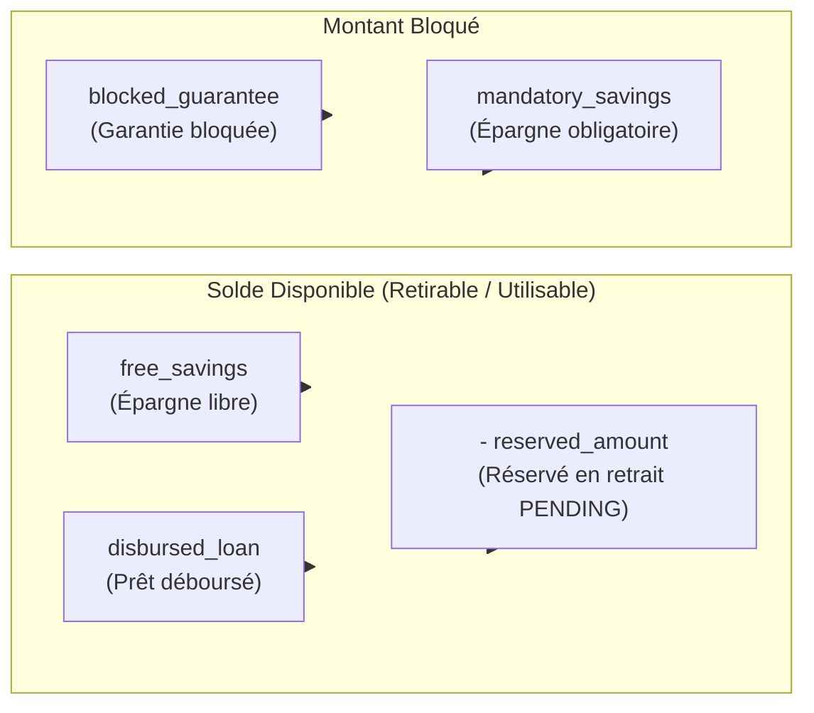
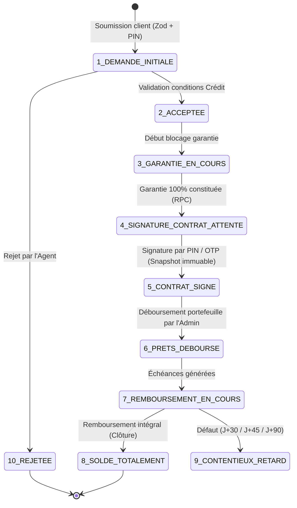

# Architecture Système — Microfinance v2.1

Ce document décrit l'architecture globale, le modèle de sécurité, le fonctionnement de la comptabilité à double entrée et le cycle de vie des opérations financières de l'application web mobile-first (PWA) de microfinance.

---

## 1. Vue d'ensemble du système

L'application est un **portail de requêtes** et un **outil de suivi** digitalisant les flux financiers de microfinance (dépôts, retraits, prêts) sans manipulation d'argent physique.



---

## 2. Modèle de Sécurité et d'Accès

### 2.1 Modèle à deux rôles isolés (ADR 0001)

L'application applique un modèle strict d'accès à **deux rôles uniques** :

1. **`client`** : Accès réservé aux routes `/client/*` et aux opérations sur son propre compte.
2. **`admin`** : Réservé au Chef d'Agence (administrateur unique), donnant accès au back-office `/admin/*`.

L'autorisation repose sur la vérification du claim JWT `app_metadata.user_role` dans `proxy.ts` et dans la fonction SQL `auth_role()` :

```sql
CREATE OR REPLACE FUNCTION auth_role() RETURNS TEXT
LANGUAGE sql STABLE AS $$
  SELECT COALESCE(auth.jwt() -> 'app_metadata' ->> 'user_role', 'client');
$$;
```

### 2.2 Sécurité du Code PIN et Récupération OTP (Isolation `app_private`)

Les données hautement sensibles du Code PIN (hashes BCrypt, compteurs de tentatives, OTP) sont **isolées** hors du schéma `public` dans le schéma `app_private` (inaccessible directement via la Data API Supabase).



---

## 3. Vérité Comptable et Portefeuille

### 3.1 Formule Unique du Solde (Invariant N°1)

Aucun solde n'est recalculé côté client. Le solde du portefeuille est calculé par la RPC `get_wallet_summary()` selon 5 composantes financières :

$$\text{Solde Disponible} = \text{free\_savings} + \text{disbursed\_loan} - \text{reserved\_amount}$$

$$\text{Montant Bloqué} = \text{blocked\_guarantee} + \text{mandatory\_savings}$$

$$\text{Patrimoine Total} = \text{free\_savings} + \text{disbursed\_loan} + \text{blocked\_guarantee} + \text{mandatory\_savings}$$



### 3.2 Immutabilité & Écritures Serveur Uniquement

- **RLS Strict** : Les requêtes d'écriture directe (`INSERT`/`UPDATE`/`DELETE`) sur les portefeuilles sont totalement révoquées pour `anon` et `authenticated`.
- **Atomicité Transactionnelle** : Chaque mouvement comptable (crédit, débit, réservation) transite par une fonction `SECURITY DEFINER` s'exécutant dans une transaction SQL atomique (changement de statut + mouvement au sein du même bloc `BEGIN...COMMIT`).

---

## 4. Cycle de Vie du Prêt & Contrat Dynamique

Le processus de demande de crédit respecte un cycle de validation en **10 états stricts** et applique le plafonnement réglementaire du Coût Effectif (TEG < 20% UMOA).



### Invariants du Contrat Dynamique

1. **Snapshot au moment de la signature** : Les clauses, l'échéancier, le taux effectif annualisé et les informations de l'emprunteur sont figés sous forme d'un document JSON/PDF immuable.
2. **Plafond de coût effectif** : Tout produit ou demande dont le taux effectif global (TEG) dépasse 20 % annualisé est bloqué par la fonction PostgreSQL `enforce_effective_cost_cap()`.
3. **Prêt vivant unique** : Un emprunteur ne peut pas soumettre de nouvelle demande s'il possède déjà un prêt actif non clôturé.
