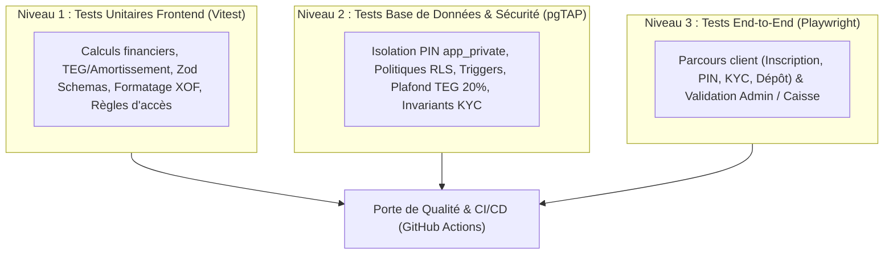
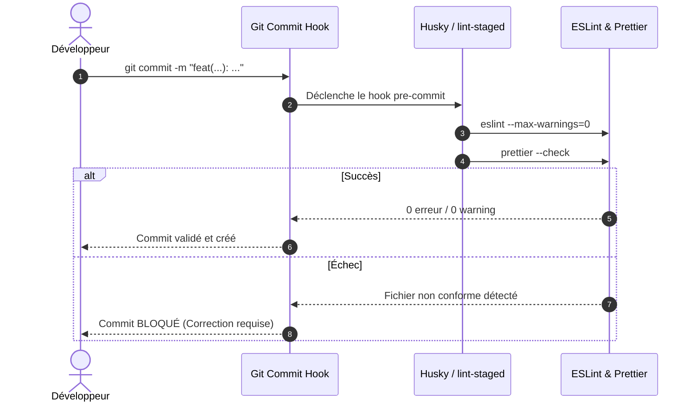

# Guide de Tests & Assurance Qualité — Microfinance v2.1

Ce document détaille la stratégie de test à trois niveaux (Vitest, pgTAP, Playwright), les contrôles de qualité automatisés et les règles d'intégration continue (CI/CD).

---

## 1. Vue d'ensemble de la Stratégie de Test

La qualité du projet est garantie à trois niveaux complémentaires :



---

## 2. Niveau 1 : Tests Unitaires (Vitest)

Les tests unitaires couvrent la logique métier pure, le calcul des intérêts, la validation des formulaires et l'intégrité des structures de données.

### 2.1 Commandes d'exécution

```bash
pnpm test          # Exécution unique de tous les tests unitaires
pnpm test:watch    # Mode interactif avec rechargement à chaud
```

### 2.2 Fichiers et domaines couverte

- **Logique Crédit & Barèmes** : [`src/lib/loans/loan-tier-rules.test.ts`](../src/lib/loans/loan-tier-rules.test.ts)
  - Calcul du TEG (Taux Effectif Global) annualisé.
  - Génération des tableaux d'amortissement à mensualités constantes sur capital restant dû.
  - Vérification du respect strict du plafond de 20 %.
- **Comptabilité Portefeuille** : [`src/lib/wallet.test.ts`](../src/lib/wallet.test.ts)
  - Calcul exact du solde disponible et des montants bloqués.
  - Gestion des devises XOF (arrondis à l'unité sans décimales).
- **Contrôle d'Accès & Auth** : [`src/lib/access-control.test.ts`](../src/lib/access-control.test.ts) & [`src/lib/auth-flow.test.ts`](../src/lib/auth-flow.test.ts)
  - Validation des redirections selon le statut KYC et la présence du PIN.
  - Vérification de l'isolation entre les espaces `/client` et `/admin`.
- **Traitement d'Image & KYC** : [`src/lib/image-compression.test.ts`](../src/lib/image-compression.test.ts) & [`src/lib/kyc-ai-verify.test.ts`](../src/lib/kyc-ai-verify.test.ts)
  - Validation de la compression d'image avant upload Supabase.
  - Tests unitaires de pré-vérification automatique des pièces d'identité.

---

## 3. Niveau 2 : Tests de Base de Données & Sécurité (pgTAP)

Les tests de base de données vérifient l'imperméabilité des politiques RLS, l'exécution correcte des triggers et l'isolation des secrets.

> **Règle d'environnement :** Le poste de développement local n'exécute ni Docker ni `supabase start`. Les tests pgTAP s'exécutent exclusivement dans un runner GitHub Actions Linux sous Docker (`.github/workflows/supabase-tests.yml`).

### 3.1 Domaines de sécurité testés par pgTAP

1. **Isolation du PIN** : Preuve que les colonnes `pin_hash` ont été purgées de `public.profiles` et sont inaccessibles via la Data API.
2. **Moindre privilège des fonctions SQL** : Révocation du privilège `EXECUTE` accordé par défaut à `PUBLIC` sur les fonctions privées.
3. **Immutabilité KYC & Storage** : Impossibilité de modifier ou supprimer une pièce d'identité une fois le dossier soumis.
4. **Invariant de prêt vivant unique** : Rejet en base de toute seconde demande si un prêt est en cours.
5. **Plafond TEG 20 %** : Annulation de transaction pour toute création de produit ou prêt dépassant le seuil réglementaire.

---

## 4. Niveau 3 : Tests End-to-End (Playwright)

Les tests E2E simulent les parcours utilisateurs réels dans un environnement navigateur.

### 4.1 Configuration

- **Fichier de configuration** : `playwright.config.ts`
- **Repertoire des tests** : `e2e/`

```bash
npx playwright test
```

### 4.2 Scénarios principaux

- **Inscriptions & Onboarding Client** : Création de compte -> Vérification email -> Création du PIN -> Saisie du KYC.
- **Demande de Dépôt & Validation Caisse** : Demande d'épargne par le client -> Validation / Crédit par le Chef d'Agence dans `/admin/cashier/deposits`.
- **Demande & Déboursement de Crédit** : Soumission de la demande -> Phase de garantie -> Signature du contrat par PIN -> Déboursement.

---

## 5. Contrôles Qualité Mécaniques & Pre-commit

Le projet impose le respect automatique des standards de code grâce à Husky et lint-staged.



### Script de génération propre des types Next

Avant chaque validation de type TypeScript, le script `clean-next-types.mjs` nettoie les types d'App Router obsolètes pour éviter des faux positifs après suppression de routes :

```bash
pnpm clean:next-types
pnpm typecheck
```
